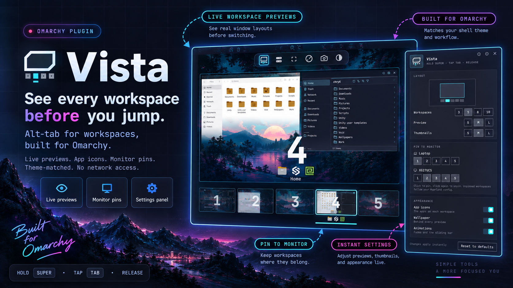

<p align="center">
  
</p>

<h1 align="center">Vista</h1>

<p align="center">
  <b>See every workspace before you jump to it.</b><br>
  Alt-tab for workspaces, built for the <a href="https://omarchy.org">Omarchy</a> shell.
</p>

<p align="center">
  <kbd>Super</kbd> + <kbd>Tab</kbd> &nbsp;·&nbsp; live previews &nbsp;·&nbsp; app icons &nbsp;·&nbsp; monitor pins &nbsp;·&nbsp; no network access
</p>

<p align="center">
  
</p>

---

**You have ten workspaces and no idea what's on them.** Was that doc on 3 or 4?
Is the terminal on 2? Stop cycling blind.

**Hold <kbd>Super</kbd>, tap <kbd>Tab</kbd>.** Your screen becomes a view of every
workspace. The one you're about to land on fills a big **live** preview of its actual
windows. Under it are a giant workspace number, the icons of its apps, and its
last window title. Along the bottom, a filmstrip of all
your workspaces shows what's on each one, with a bar sliding under your pick.

**Let go, and you're there.** Or just tap it: a quick <kbd>Super</kbd>+<kbd>Tab</kbd>
jumps to the next workspace with nothing drawn at all.

## Why you'll keep it

- 🔭 **Live previews.** Real window contents at their real positions, captured straight from each window, with nothing saved to disk.
- 🧩 **Know it at a glance.** App icons and a giant number on every workspace.
- ⚡ **Built for muscle memory.** Hold, tap, tap, release. `Shift+Tab` goes back, and `1`–`0`, the arrows, the mouse and the wheel all work too.
- 🖥️ **Pin workspaces to monitors.** Laptop plus external? Put 1 on the laptop and 2–5 on the big screen with a click. Pins follow the monitor even if it moves to another port.
- 🎛️ **Settings with a click, not a config file.** A bar icon opens a live settings panel with a scale sketch that redraws as you change sizes.
- 🎨 **Matches your theme.** Colours, fonts and corner radius come from your current Omarchy theme.
- 🔒 **Stays local.** No network access, nothing written except its own settings, and every label rendered as plain text. Details [below](#what-vista-does-on-your-system).

## Install

```bash
omarchy plugin add https://github.com/chyld/omarchy-vista --enable
```

Vista needs two keybindings, which you add yourself. Paste these lines into
`~/.config/hypr/bindings.lua`, below anything else that binds `SUPER + TAB`
(the same lines are in [`bindings.lua`](bindings.lua)):

```lua
hl.unbind("SUPER + TAB")
hl.unbind("SUPER + SHIFT + TAB")
o.bind("SUPER + TAB", "Vista: next workspace", hl.dsp.global("chyld-vista:next"), { repeating = true })
o.bind("SUPER + SHIFT + TAB", "Vista: previous workspace", hl.dsp.global("chyld-vista:prev"), { repeating = true })
hl.layer_rule({ match = { namespace = "chyld-vista" }, no_anim = true })
```

They replace Omarchy's default `SUPER + TAB` (next workspace) and
`SUPER + SHIFT + TAB` (previous workspace). Hyprland picks them up when you
save the file. Vista never edits your Hyprland files.

Requirements: Omarchy 4 (omarchy-shell) with the Hyprland Lua config.

## Use

| Keys | Does |
|---|---|
| Hold `Super`, tap `Tab` / `Shift+Tab` | open, then move to the next / previous workspace (wraps) |
| Release `Super` | switch to the selected workspace |
| `←` `→` / `h` `l`, mouse wheel | move the selection |
| `1`–`9`, `0` | switch straight to workspace 1–10 |
| `Enter`, click a card | switch |
| `Esc`, click outside | close without switching |

## Settings

Click the Vista icon in the bar. Changes apply immediately.

- **Workspaces**: always show 1 to N (3, 5, 8 or 10); any other workspace that exists is added in numeric order.
- **Preview** and **Thumbnails**: small, medium or large.
- **Pin to monitor**: click a workspace on a monitor's row to pin it there, and click it again to unpin it.
- **App icons**, **Wallpaper**, **Animations**: on or off.

Settings are saved on Vista's bar entry in `~/.config/omarchy/shell.json`, through Omarchy's own plugin settings API.

## What Vista does on your system

- **No network access.** Vista makes no requests of its own. Every text label is rendered as plain text.
- **Files:** it writes nothing itself. Its settings are saved by the Omarchy shell on Vista's bar entry in `~/.config/omarchy/shell.json`.
- **Reads:**
  - window and workspace state from Hyprland
  - app icons from desktop entries and the icon theme
  - the current Omarchy wallpaper at `~/.local/state/omarchy/current/background`
- **Commands:** all run as `/usr/bin/hyprctl` with an argument list, never through a shell.
  - `dispatch` to switch workspace, and to move a pinned workspace onto its monitor.
  - `eval` to ask whether Super is still held. It runs only while the switcher is open, one query at a time, for at most 30 seconds per opening.
  - `eval` to add a workspace rule for each pin.
  - `reload` when you unpin a workspace, then `workspacerules -j` to move it back to the monitor your own config names.
- **Monitor pins** are runtime Hyprland workspace rules. They take priority over your config's rule for that workspace, and nothing is written to your Hyprland files.
  - Hyprland drops them on a config reload, so Vista applies them again after every reload and when a monitor connects.
  - Pins are stored by the monitor's EDID description, so they survive a monitor moving to another port.
  - A pin to a monitor that isn't connected waits until it is.
  - Unpinning reloads the Hyprland config, because a rule can't be taken back, only replaced. That restores your own rule.

## Remove

```bash
omarchy plugin remove chyld.vista
```

That removes the plugin and its bar entry, including every Vista setting and
pin in `~/.config/omarchy/shell.json`. Then:

- Delete the Vista lines you pasted into `~/.config/hypr/bindings.lua`, which brings back Omarchy's defaults for `SUPER + TAB` and `SUPER + SHIFT + TAB`.
- Pins that were active stay in effect until Hyprland's config next reloads (`hyprctl reload`, or saving any Hyprland config file) or you log out. Nothing else remains.

## Development

| File | Role |
|---|---|
| `Service.qml` | Settings, switcher state, input, and opening, committing and closing the switcher |
| `Switcher.qml` | The overlay window (view only) |
| `WorkspacePreview.qml` | One workspace drawn to scale with live window captures |
| `SuperWatch.qml` | Asks Hyprland whether Super is still held |
| `PinManager.qml` | Monitor pins as runtime Hyprland workspace rules |
| `AppIcons.qml` | App icons per workspace, bounded cache |
| `Hypr.js` | Every `hyprctl` command Vista runs |
| `Safe.js` | Validation for every value that isn't a literal in the code |
| `Settings.qml`, `Logo.qml` | The bar icon and its settings popup |

Run the tests with `node --test tests/`.

## License

MIT
